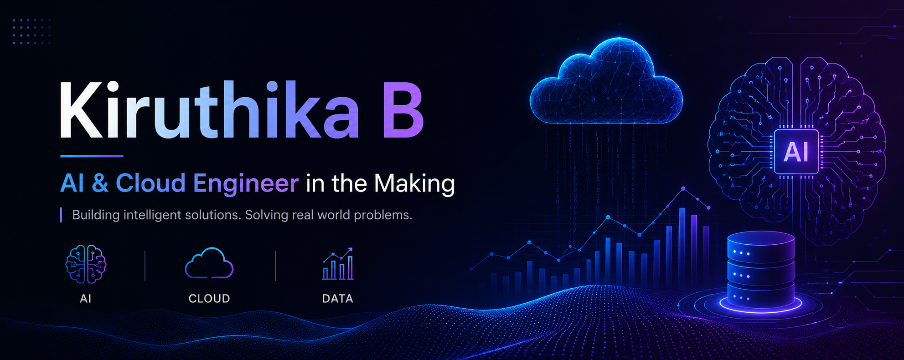

  

<h1 align="center">Hi, I'm Kiruthika B 👋</h1>
<h3 align="center">Aspiring AI Engineer | B.Tech IT Graduate | Building toward 2027</h3>

  

---

### 🧭 About Me

- 🎓 B.Tech in Information Technology, Easwari Engineering College, Chennai (CGPA: 8.72/10) — Class of 2026
- 📄 Published IEEE conference paper — ICMSCI 2026, Erode
- 🏅 IndiaAI Fellowship recipient
- 🎯 Long-term goal: **AI Engineer by 2027**
- 🌱 Currently deepening my skills in cloud infrastructure, containerization, and applied AI

---

### 🛠️ Tech Stack

  
  
  
  
  
  
  
  
  
  

---

### 🚀 Featured Projects

**[Zen Invoice & Receipt Flow System](#)**
Client-side SaaS MVP for invoice/receipt management — React 18, TypeScript, Tailwind CSS, Vite.

**[Tech Pulse — All-in-One Productivity App](#)**
Productivity suite combining a focus timer, habit tracker, and life-management modules, with AI integration via the Claude API.

**Personal Portfolio Site**
Dark-themed, single-file HTML/CSS/JS site with custom animations and a projects/certifications showcase.

---

### 📊 GitHub Stats

  

---

### 📫 Connect With Me

  
  

